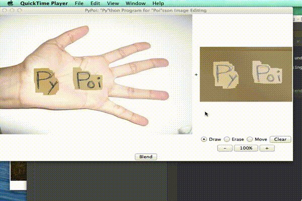

# PyPoi
**PyPoi** is an image processing GUI program written in Python under Apache
License 2.0. PyPoi stands for "<b>Py</b>thon Program for <b>Poi</b>sson Image Editing".

It enables you to try the Poisson Image Editing method interactively.
Some examples are already ready for you, but you can also load arbitrary images and try it.



## Get Started
Well... no worries! If you're using **Windows** or **Mac OS**, you simply need to download files and run it to try this program.

### Simple installation
1. Go to [the release page](https://github.com/fbessho/PyPoi/releases)
2. From the latest version, download zip file (recommended) or executable file.
3. If you download zip file, extract the file in any folder, and double click

### Run from repository (for developer)
You need to have **Python2.7** and pip installed before starting it.
It is recommended to use virtualenv. Please refer to [this guide](http://docs.python-guide.org/en/latest/dev/virtualenvs/
) to know how to install/use it if you're not familiar with it.

First of all, clone the repository

```
git clone https://github.com/fbessho/PyPoi.git
cd PyPoi
```

Then create a new virtualenv

```
mkvirtualenv pypoi
```

Install required packages

```
pip install -r requirements.txt
```

**If you get error in pyamg installation, please install numpy first by the following command, and try the install command above again.**

```
pip install $(grep numpy requirements.txt)
# or
# pip install numpy==1.8.1
# or
# pip install numpy
```

Alright, now you're ready to start. Try the following command.
An old-fashioned tkinter GUI should appear in front of you :beer:.

```
cd pypoi
python gui.py
```


## What is Poisson Image Editing?
Poisson Image Editing is a technique to blend two images _seamlessly_.

This method is firstly introduced by Patrick Pérez and others in ACM SIGGRAPH 2003.
The original theses is available
[here (pdf)](http://www.cs.princeton.edu/courses/archive/fall10/cos526/papers/perez03.pdf).

### Resources
There are many resources about Poisson Image Editing and I'll leave explanations to them.

* **English**
  * [Original theses (pdf)](http://www.cs.princeton.edu/courses/archive/fall10/cos526/papers/perez03.pdf)
  * [Simple introduction and examples](http://cs.brown.edu/courses/csci1950-g/results/proj2/pdoran/index.html)
  * [Detailed introduction by Chris Tralie](http://www.ctralie.com/Teaching/PoissonImageEditing/)
    * **With many funny examples**.
    * Hot discussion including technical details at the bottom too.
    * Also contains Java implementation. Please see the chapter below.
* **Japanese**
  * [Introduction in Japanese 1 (pdf)](https://www.hal.t.u-tokyo.ac.jp/paper/2010/Journal_12.pdf)
  * [Introduction in Japanese 2 in OpenCV.jp](http://opencv.jp/opencv2-x-samples/poisson-blending)
  * [Introduction in Japanese 3](http://blog.takuti.me/2013/12/poisson-image-blending/)

### Implementation in other languages
There have already been several implementation in other language.
* [**Java** by Chris Tralie](http://www.ctralie.com/Teaching/PoissonImageEditing/#tryit)
* [**Python** by parosky](https://github.com/parosky/poissonblending/)
  *  As of v0.1.0, core calculation is the copy of this implementation.
* [**JavaScript** by takuti](http://takuti.me/dev/poisson/demo/)
  * [Introduction in Japanese is available too](http://blog.takuti.me/2013/12/poisson-image-blending/)
* [**MATLAB and C** by Toshihiko Yamasaki (pdf)](https://www.hal.t.u-tokyo.ac.jp/paper/2010/Journal_12.pdf)

## Found issues?
Please raise an issue from [github issue page](https://github.com/fbessho/PyPoi/issues).

## What's next?
I know there are a lot of space to improve.
Main enhancements are listed in [the issue tracker](https://github.com/fbessho/PyPoi/issues), for example,
* [#8  Gradient mixture support](https://github.com/fbessho/PyPoi/issues/8)
* [#3  Add tests](https://github.com/fbessho/PyPoi/issues/3)
* [#12 Calculation speed improvement](https://github.com/fbessho/PyPoi/issues/12)

It's more than welcome if you can pick up one/some of them.

## License
PyPoi is provided under Apache License 2.0. Please refer to [LICENSE](License)

## Acknowledgement
The core function is from [parosky/poissonblending/](https://github.com/parosky/poissonblending/)
